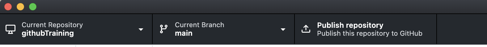

# Intro to GitHub & GitHub Desktop

-- Tytell Lab GitHub Training       

Date: 2024-04-25      

Author: Shirley Xue Li, Bioinformatician, TTS Research Technology, Tufts University       
Email: xue.li37@tufts.edu   
**Research Technology Contact: [tts-research@tufts.edu](mailto:tts-research@tufts.edu)** 

[toc]

# 1. Set up GitHub Desktop     

GitHub Desktop can be downloaded [HERE](https://desktop.github.com/).

To create a GitHub Account, following instructions [HERE](https://docs.github.com/en/get-started/start-your-journey/creating-an-account-on-github).

To set up GitHub Desktop, follow instructions [HERE](https://docs.github.com/en/desktop/installing-and-authenticating-to-github-desktop/setting-up-github-desktop). 

# 2. Get started with GitHub Desktop     

## 2.1 Create a new repository and publish it.      
1. Under `File`, select `New repository`, then fill in the information, and hit `create repository`. Remember to change Local Path to your own path    
  
2. In the repository bar, click `Publish repository`. Check your GitHub website, you will see this new repo under your Repositories. 

3. Navigate to GitHub website to check your new repository.      

## 2.2 Making, commiting, and pushing changes.    

1. Click `Show in Finder` folder, this will be the local folder of your GitHub Repo.    

2. For Mac users, `Command + Shift + .` to show hidden files. You will see `.git` folder which contains stores all the metadata and object database for that project.      

3. `Command + Shift + .` to hide hidden files.       
4. Make changes to your local repo. Ex: Create a new file called `file.txt`. 
5. In GitHub Desktop, navigate to the Changes view. In the file list, you should see your file.txt. The checkbox to the left of the file.txt file indicates that the changes you've made to the file will be part of the commit you make. In the future, you might make changes to multiple files but only want to commit the changes you've made to some of the files. If you click the checkbox next to a file, that file will not be included in the commit.          

6. You can write the commit message in `commit message`, click `Commit to main`. Ex: we can write commit message as 'Create file.txt'.  

7. To push your changes to the remote repository on GitHub, click Push origin.    

8. In your browser, check the changes to the remote repo.      

## 2.3 Fetching, and pulling changes from remote repo to local repo.   

1. In your brower, make some edits to file.txt. Ex: Add `Hello World` as first line and then `commit changes`.   
 

2. `Fetch origin` to check the changes in remote repo. This will only check the changes made in origin, and your local repo won't be overwritten. 

3. `Pull origin` to pull the changes and update the local repo. Your local repo will be overwritten.   

4. You can see your `file.txt` has been updated.         

# 3. Restore a previous version

Under the History section, you can revert a commit by clicking on `Revert Changes in Commit`. This action will generate a new commit that restores the project to its former version. With GitHub Desktop, reverting is limited to the most recent commit only. When you revert multiple commits, it's best to revert in order from newest to oldest. If you revert commits in a different order, you may see merge conflicts. 

> :warning:  **Always write clear and detailed commit messages! This practice will enable quicker identification of previous versions for potential reverts.**  

 

# 4. Addressing conflicts between local and remote.      

## 4.1 Intentionally create a conflict.                 

* In your browser, edit file.txt. Ex: Add `Hello Medford` as second line and then `commit changes`.            
* Locally, edit file.txt. Ex: Add `Hello Boston` as second line, and then `Commit to main`.         

* After you `Commit to main`, under `Pull origin` in repository bar, you can see one up arrow and one down arrow. This means that you are one step behind remote repo (Adding `Hello Medford` as second line), but at the same time one step ahead remote repo (Adding `Hello Boston` as second line).  
  

* When you `Pull origin`, you will see conflict warning.     
  
* An explanation of `file.txt` with conflict. 
    * <<<<<<< HEAD: Everything between this line and the ======= line are your changes—the content from local repo where you're trying to push into remote.     
    * After the ======= line, the content up until >>>>>>> represents the incoming changes from remote repo that you are trying to push to.     
    

## 4.2 Resolve the conflict.     

* Click `View conflicts` and right click the down arrow in the new window.          

* There are two simple options, `Use the modified file from main` and `Use the modified file from origin/main`.        
    * `main` represents local repo main branch

    * `origin/main` represents remote repo main branch.       
    
       

* There is also a third option, when you don't like the version in local repo and the version in remote repo. You can edit the file.txt again to make new changes.           
    * Ex: Let's change the file content, so the first line is still `Hello World`, but the second line is `Hello Tufts`.                     
    
* You can commit and push again. This new commit will overright the previous commits made locally and globally. 
* Check the file.txt in your browser, you can now see something like below.              
  

# 5. Addressing conflicts between main and other branch

## 5.1 Intentionally create a conflict. 

+ Create a test branch with name `test`, then publish the branch. 

   

* In test branch, edit file.txt. Ex: Add `Hello Dog` as the third line, then `Commit to test`, then `Push orgin`. 

* Switch back to main branch, edit file.txt. Ex: Add `Hello Cat` as the third line, then `Commit to main`, then `Push orgin`. 

* Switch back to test branch again. 

* Under menu bar `Branch`, click `compare to branch`, then select `main` branch to compare with.      

   

* Under Changes, you will see `Behind(1)` and `Ahead(1)`, which means local branch is one step behind main branch, because it doesn't add line `Hello Cat`, and at the same time, it is one step ahead main branch, because it adds line `Hello Dog` which main branch doesn't have. 

* In your browser, you can still create a pull request to merge test branch to main branch. But you will see conflict warning. 
## 5.2 Resolve conflict.      
* In your browser, check the conflicts and create a new commit under test branch. 
* Merge again.     
* Check the two branches, you will see the file.txt is the version after you made the new commit to test branch. 
  

