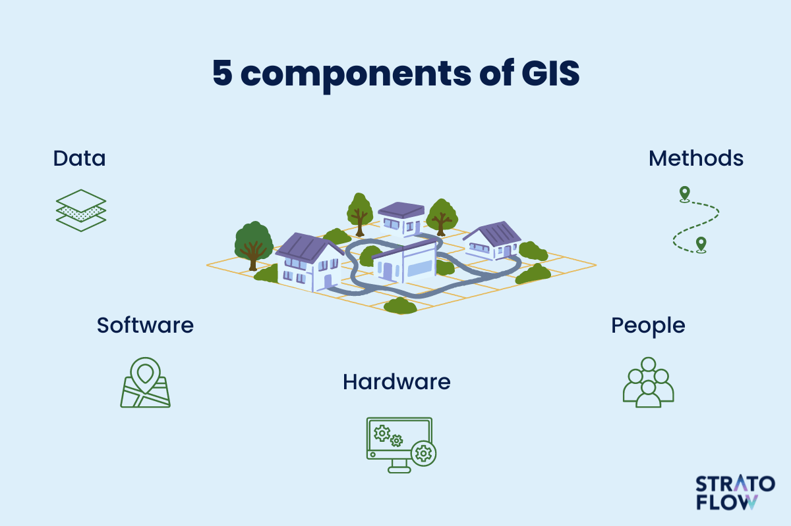
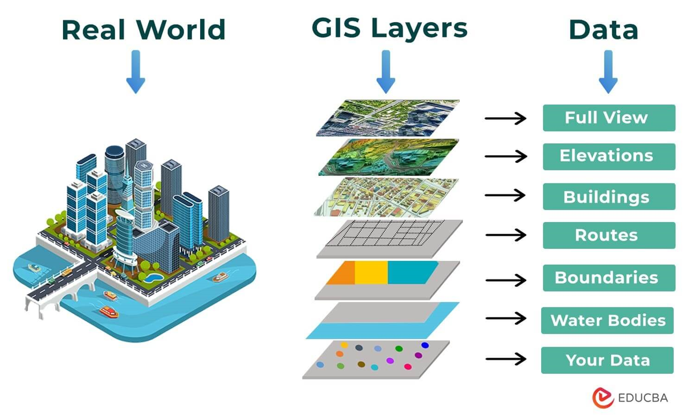
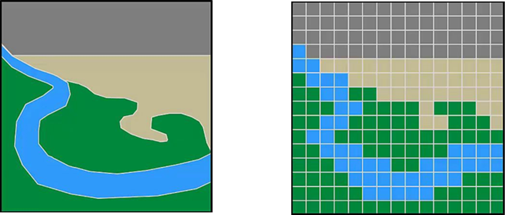

# What is GIS?

## Learning Objectives
* Understand the components of a GIS
* Differentiate the 2 major types of GIS data
* Describe examples of GIS use cases

**Note: To navigate to a specific section in the below, please click the Table of Contents located in the right panel under the “On this Page”.**

## GIS, defined

A geographic information system (GIS) lets users visualize, question, analyze, and interpret *spatial data* to understand relationships, patterns, and trends. 

A GIS is a system of **computer hardware** (computer, phone, tablet, etc.), **software** (ArcGIS online, ArcGIS Pro, QGIS), **data**, and **personnel** for working with infomration to a *location*. 

*Diagram from stratoflow.com*

**You probably already used GIS today!**

- Did you use Google Maps to drive to work or school?
- Maybe you looked at an interactive map to book your next flight?
- Or perhaps you snooped on your neighbors on Zillow's maps?

GIS is a powerful tool! 

## How does a GIS work?
GIS shows the world as a stack of *layers*. These can be anything! Each layer represents a specific feature or phenomena, whether it is ice cream stores, political boundaries, air quality, bike lanes, or anything else.

## Who is using GIS?
**Who isn't?** 

Public Health researchers map disease outbreaks, air quality, access to healthcare, and more. Historians rely on maps not just for textbooks, but for interactive exhibits and web maps. Maps of elections, demographic data, conflict zones, crime, crop production, property values, and more are ubiquitous. GIS can be used for disaster response, climate resilience, urban and regional planning, transportation, and the list goes on!

## What is GIS data?
*aka spatial data, geospatial data, geodata, shapefiles, geodatabases, location intelligence*

This is digital information reference with geographic coordinates. Each piece of information has an associated location in the real world that it refers to!

GIS data can be downloaded in GIS-ready formats from numerous sources, collected in the field, imported from tabular data, or digitized from print maps.

GIS data consists of 2 major types:

- **Vectors**: these are points, lines, and polygon *objects* that represent discrete features and can have limitless information about the features, called attributes
- **Rasters**: these are arrays, or grids of pixels/cells. Image data is a type of raster data. These formats show continuous data like elevation and temperature and each pixel represents one value

*The left side represents vector data while the right side represents raster data*

Regardless of the format, the data is still a representation of the underlying world!

>  **To Get Support:** - Please email DataLab-Support@elist.tufts.edu for all GIS and geospatial help.